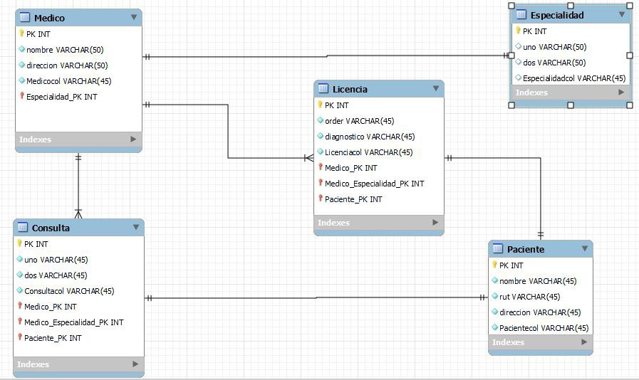

 <h1 align= left ><b>Grupal 5 M7 /EquipoBoldo</b> </h1>

<br>

<h2><b>Descripción del Proyecto</b> </h2>

📝 En elsiguiente problema se debe entregar como resultado el modelo lógico y físico del caso presentado a
continuación utilizando ORM según el siguiente planteamiento.
Una clínica requiere que generemos el modelo de su lógica de negocio de acuerdo a los siguientes requerimientos:
1. Un médico tiene una especialidad.
2. El médico tiene un nombre, rut y dirección.
3. La especialidad tiene un código y una descripción.
4. El médico realiza consultas a distintos pacientes.
5. Un paciente agenda una o muchas consultas.
6. La consulta tiene una fecha, hora de atención y número de box (consultorio).
7. El paciente tiene un nombre, rut y dirección.
8. Un médico puede o no entregar una licencia a un paciente.
9. La licencia tiene un código, un diagnóstico, una fecha de inicio y una fecha de término.


<br>

<h2><b>Instrucciones de Instalación</b> </h2> 

⚙️ Para instalar las dependencias necesarias, sigue los siguientes pasos:

1. Clona el repositorio en tu máquina local.
2. Abre una terminal y navega hasta la carpeta del proyecto.
3. Ejecuta el siguiente comando para instalar las dependencias:

   npm install

4. Abrir el archivo html ingresando al https://localhost:3000


<br>

<details>  <summary><b>Ver las instrucciones</b></summary> 


1. Instalar las dependencias:

   ```sh
   npm install
   ```

2. En el caso de no poder instalar las dependencias:

   ```sh
   npm install --force
   ```

3. Las librerias que estamos ocupando `package.json`:

    ````sh
    ... 
    "name": "helpers",
    "version": "1.0.0",
    "description": "",
    "main": "index.js",
    + "type": "module",
    "scripts": {
    "test": "echo \"Error: no test specified\" && exit 1"
    },
    "author": "",
    "license": "ISC",
    "dependencies": {
    "commander": "^11.0.0",
    "express": "^4.18.2",
    "pg": "^8.11.2",
    "pg-cursor": "^2.10.2",
    "pg-hstore": "^2.3.4",
    "sequelize": "^6.32.1"
    }
    ````

 
</details>

## Funcionalidades :sparkles:

✨ Con nuestra aplicacion con ORM podremos visualizar el siguiente diseño:




<!--  -->

## Participantes del Grupo :busts_in_silhouette:

1. Loreto Godoy : https://github.com/loreGodoyUp

2. Daniel Mendez : https://github.com/danimen81

3. Zimram Blanco : https://github.com/Zimram

4. Jose Fuentealba : https://github.com/JoseFelipeGeo

5. Boris Guiñez : https://github.com/boanguibe

6. Felipe Andres Parra : https://github.com/33fparra


### Este proyecto está bajo la licencia ADALID.


